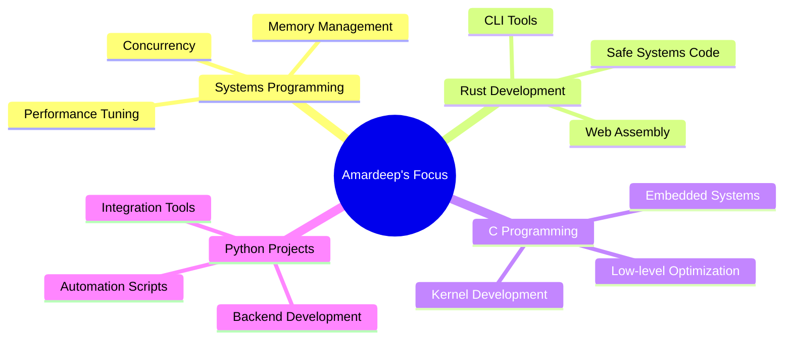

#  Hey there! I'm Amardeep Biswas

<div align="center">
  
</div>

---

## 🚀 About Me

```rust
struct AmardeepBiswas {
    name: String,
    role: String,
    location: String,
    languages: Vec<String>,
    interests: Vec<String>,
    currently_learning: String,
}

impl AmardeepBiswas {
    fn new() -> Self {
        Self {
            name: "Amardeep Biswas".to_string(),
            role: "Systems Developer & Programmer".to_string(),
            location: "India".to_string(),
            languages: vec![
                "Rust".to_string(), 
                "C".to_string(), 
                "Python".to_string()
            ],
            interests: vec![
                "Systems Programming".to_string(),
                "Performance Optimization".to_string(),
                "Low-level Development".to_string(),
                "Open Source".to_string()
            ],
            currently_learning: "Advanced Rust & Systems Design".to_string(),
        }
    }
    
    fn say_hi(&self) {
        println!("Thanks for dropping by! Let's build fast and reliable software together! 🚀");
    }
}

fn main() {
    let me = AmardeepBiswas::new();
    me.say_hi();
}
```

---

## 🛠️ Tech Stack & Tools

<div align="center">

### 🔧 Core Languages


### 🛠️ Systems & Tools


### 🚀 Areas of Interest


</div>

---

## 📈 GitHub Stats

<div align="center">
  
  
</div>

<div align="center">
  
</div>

<div align="center">
  
</div>

---

## 🎯 Current Focus

<div align="center">



</div>

---

## 🌟 What I'm Up To

- 🦀 **Crafting** high-performance applications in Rust with memory safety
- ⚡ **Optimizing** system-level code in C for maximum efficiency
- 🐍 **Building** automation tools and backend services with Python
- 🔧 **Exploring** systems programming concepts and low-level optimization
- 🚀 **Contributing** to open-source projects in systems programming
- 💡 **Learning** advanced concurrency patterns and performance techniques

---

## 📊 Weekly Development Breakdown

<!--START_SECTION:waka-->
```text
Rust         8 hrs 45 mins   ████████████░░░░░░░░░  45.2%
C            6 hrs 30 mins   ████████░░░░░░░░░░░░░  33.5%
Python       3 hrs 15 mins   ████░░░░░░░░░░░░░░░░░  16.8%
Shell        45 mins         █░░░░░░░░░░░░░░░░░░░░   3.9%
Other        10 mins         ░░░░░░░░░░░░░░░░░░░░░   0.6%
```
<!--END_SECTION:waka-->

---

## 🏆 GitHub Trophies

<div align="center">
  
</div>

---

## 🤝 Connect With Me

<div align="center">

[](mailto:amardeepbiswas9@gmail.com)
[](https://linkedin.com/in/amardeep-biswas)
[](https://github.com/Biswas005)
[](https://your-portfolio-link.com)

</div>

---

## 💭 Random Dev Quote

<div align="center">
  
</div>

---

## 🐍 Contribution Snake

<div align="center">
  
</div>

---

<div align="center">
  
  
  ### Thanks for visiting! 🚀
  
  
  
  *"The best way to predict the future is to create it with data!"* 📊✨
</div>
