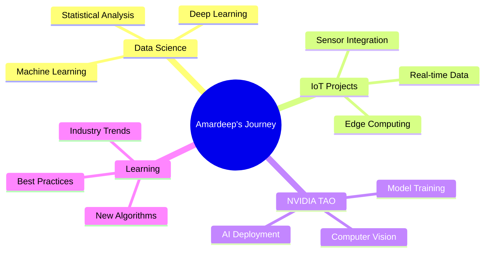

#  Hey there! I'm Amardeep Biswas

<div align="center">
  
</div>

---

## 🚀 About Me

```python
class AmardeepBiswas:
    def __init__(self):
        self.name = "Amardeep Biswas"
        self.role = "Data Science Enthusiast"
        self.location = "India"
        self.interests = [
            "Data Science", 
            "Machine Learning", 
            "Internet of Things (IoT)", 
            "NVIDIA TAO"
        ]
        self.currently_learning = "Data Science"
        self.goals = "Building intelligent solutions with data"
    
    def say_hi(self):
        print("Thanks for dropping by! Let's connect and build something amazing together!")

me = AmardeepBiswas()
me.say_hi()
```

---

## 🛠️ Tech Stack & Tools

<div align="center">

### 📊 Data Science & ML


### 🌐 IoT & Hardware


### 💻 Development


</div>

---

## 📈 GitHub Stats

<div align="center">
  
  
</div>

<div align="center">
  
</div>

<div align="center">
  
</div>

---

## 🎯 Current Focus

<div align="center">



</div>

---

## 🌟 What I'm Up To

- 🔬 **Exploring** advanced machine learning algorithms and their real-world applications
- 🤖 **Building** IoT solutions that bridge the physical and digital worlds
- 📚 **Learning** cutting-edge techniques in data science and AI
- 🚀 **Experimenting** with NVIDIA TAO for computer vision projects
- 💡 **Contributing** to open-source projects in the data science community

---

## 📊 Weekly Development Breakdown

<!--START_SECTION:waka-->
```text
Python       12 hrs 30 mins  ████████████░░░░░░░░░  65.2%
Jupyter      4 hrs 15 mins   ████░░░░░░░░░░░░░░░░░  22.1%
Markdown     1 hr 45 mins    ██░░░░░░░░░░░░░░░░░░░   9.1%
YAML         40 mins         █░░░░░░░░░░░░░░░░░░░░   3.5%
Other        5 mins          ░░░░░░░░░░░░░░░░░░░░░   0.1%
```
<!--END_SECTION:waka-->

---

## 🏆 GitHub Trophies

<div align="center">
  
</div>

---

## 🤝 Connect With Me

<div align="center">

[](mailto:amardeepbiswas9@gmail.com)
[](https://linkedin.com/in/amardeep-biswas)
[](https://github.com/Biswas005)
[](https://your-portfolio-link.com)

</div>

---

## 💭 Random Dev Quote

<div align="center">
  
</div>

---

## 🐍 Contribution Snake

<div align="center">
  
</div>

---

<div align="center">
  
  
  ### Thanks for visiting! 🚀
  
  
  
  *"The best way to predict the future is to create it with data!"* 📊✨
</div>
